# Notice-First Plant Tagging Prototype

## Purpose

This is a prototype for the AR game's observation loop. It makes **notice
proposals** before any botanical feature/value classification.

The desired behavior is not "segment perfectly or discard." A user standing in
front of a plant may send a sequence of imperfect frames. The system preserves
every valid candidate polygon, scores it, and exposes the highest-value
candidates for review or downstream classification. Lower-ranked and failed
candidates remain measurable training signal.

```mermaid
flowchart LR
  CAP["AR capture stream\nframes, location, subject/session"] --> GROUND["Open-vocabulary organ grounding\nleaf · flower · fruit · stem · bark · bud"]
  GROUND --> SAM["SAM 2.1 mask refinement\nnormalized polygon + bbox fallback"]
  SAM --> LEDGER["Append-only notice-proposal ledger\nall candidates, failures, model provenance"]
  LEDGER --> SCORE["Representativeness ranker\nquality, framing, diversity, novelty"]
  SCORE --> TOP["Top 5 per subject × organ\nshown to curator"]
  SCORE --> STORE["All other proposals retained\nfor active learning / QA"]
   TOP --> REVIEW["Curator accepts, edits, or rejects\npolygon notice"]
   REVIEW --> TREE["Pre-curated hierarchy planner\nonly unlock confirmed children"]
   TREE --> CROP["Crop/tagged image region"]
   CROP --> CLASSIFY["Feature presence then\nfeature-value classification"]
   CLASSIFY --> ASSERT["SourceAssertion\nrelease + source feature + source value"]
   ASSERT --> PRODUCT["Source-aware candidate intersection\ninstance recommendation → curator confirmation"]
```



## Model recommendation

**Prototype default:** Grounding DINO plus **SAM 2.1**.

1. **Grounding DINO** takes explicit organ prompts and proposes boxes. This is
   important because SAM is class-agnostic: automatic-mask output alone has no
   notion of "leaf" versus background.
2. **SAM 2.1** refines each box to a pixel mask; the prototype converts the
   mask into a normalized polygon and stores the enclosing bbox as a fallback
   for the current app.
3. **SAM 2.1 small** is the operational default. Use tiny for local smoke tests
   and large on a CUDA worker when boundary accuracy warrants the cost.
4. **SAM 2.1 video propagation** is the upgrade path for continuous AR capture:
   prompt/review one good frame, propagate the mask over adjacent frames, then
   re-rank the stream.

Why this is the right initial choice:

- Meta's official SAM 2.1 code supports image and video prompts, automatic mask
  generation, multi-object masks, and Apache-2.0 licensing.
- Grounded SAM 2 is an established integration of Grounding DINO with SAM 2;
  its documented output is boxes, masks, labels, and scores, which maps directly
  to this proposal schema.
- Plant-specific evidence supports this **ground then refine** structure:
  Leaf-Only SAM shows zero-shot leaf masks are useful but moderate in complex
  scenes; Grounded-SAM plus a small leaf classifier improves precision with few
  labeled examples; plant-specialized foreground representations can be added
  later without changing our record format.

Do not claim this is a final plant-specific SOTA model. It is a strong,
reproducible **foundation baseline** with the correct interfaces for the CV
team to improve.

## Current implementation

```text
segmentation/
  pipeline.py         immutable proposal data model, scores, ranking, JSON export
  grounded_sam2.py    optional Grounding DINO + SAM 2.1 inference backend
scripts/
  tag_photo_stream.py batch CLI
```

The runtime backend is deliberately optional. The canonical experiment adapter
continues to work without PyTorch.

## Hierarchical workflow contract

`hierarchical_pipeline.py` is the executable boundary between the research
problem and the product workflow. It does not make a biological claim or run a
classifier. Instead, it accepts a **pre-curated** tree of taxon, notice, and
source-feature tasks and releases a child task only after its parent has been
curator-confirmed.

```text
kingdom:Plantae confirmed
  -> notice:leaf may be proposed and reviewed
    -> source feature: leaf arrangement may be classified
      -> source-valid value may narrow candidate taxa
        -> a non-binding instance recommendation is shown to a curator
```

This permits a piecewise agentic capture cycle without letting an agent skip a
semantic gate. The tree is intentionally configuration supplied by the product
or research team: the current GoBotany release supplies source feature/value
terms and species-to-genus parentage, but not a complete rank tree or a reliable
feature-parent tree. Those relationships must therefore be curated explicitly,
versioned, and reviewed rather than inferred from labels.

The recommendation contract accepts only curator-confirmed feature values. It
validates each value against its source release, intersects compatible candidate
taxa, and returns the contributing release IDs, feature observations, and notice
polygon IDs. Multiple source vocabularies may participate, but their assertions
are never merged into one source-less fact. A recommendation is non-binding and
must remain editable/confirmable by a curator.

```bash
# One-time, in fieldguidevision
uv sync --extra segmentation

# Run a 100-frame/tagged-photo batch over the current Pound Ridge iNat corpus.
# Uses SAM 2.1 small by default; write-once output protects provenance.
uv run python scripts/tag_photo_stream.py \
  --limit 100 \
  --top-k 5 \
  --output trials/artifacts/pound-ridge-grounded-sam2-100.json

# Local smoke / lower-resource run
uv run python scripts/tag_photo_stream.py \
  --limit 1 \
  --segmenter-model facebook/sam2.1-hiera-tiny \
  --device mps \
  --output trials/artifacts/pound-ridge-grounded-sam2-smoke.json

# Derive a small presentation queue from an existing immutable batch without
# re-running the models. This selects the top five across each organ category.
uv run python scripts/select_notice_gallery.py \
  trials/artifacts/pound-ridge-grounded-sam2.1-small-100.json \
  --top-k 5 \
  --scope category \
  --output trials/artifacts/pound-ridge-grounded-sam2.1-small-100-gallery.json
```

Inputs are the current replacement for JM's original sample:

```text
observations_pound_ridge/ward_pound_ridge_species.csv
```

It contains iNaturalist photo URLs and licenses. The old local JM Spring
`sample.csv` is not present in this worktree; the CLI accepts `--source` so that
file can be used directly when recovered.

## Export schema

`arq.notice-proposal-batch/v1` is intentionally a **proposal** format, not a
confirmed product assertion.

Each proposal includes:

- observation and photo identity, image URL, subject/species hint, license
- `notice_category_id`, for example `category:leaf`
- normalized polygon and `bbox_x0..bbox_y1`
- detector confidence, SAM mask quality, stability, area/framing quality
- one scalar `representative_score`, flags, rank, selected-for-review boolean
- model name, checkpoint/version, prompt, and review state

Open-vocabulary detector text is retained separately as `detector_label`. A
phrase that maps to more than one controlled organ (for example, `fruit bud`)
is routed to `category:ambiguous_organ` for review rather than being silently
assigned a false category.

The current app only stores/renders bboxes in `image_annotations`. The export
therefore includes the bbox now and the true polygon required by the next app
migration. Do **not** flatten the polygon to a bbox in the source record.

## Ranking: display five, retain the stream

The current deterministic score is a bootstrap, not a learned truth:

```text
0.30 × grounding confidence
+ 0.30 × SAM predicted mask quality
+ 0.15 × mask stability
+ 0.15 × useful area score
+ 0.10 × border/framing score
```

The default review queue ranks globally by `organ category`, so a presentation
can show the top five leaves, flowers, fruits, and so on. Use
`--selection-scope subject-category` to choose the best frames for one observed
plant. A future feature classifier will add a third scope: top five by
source-specific feature/value. The prototype never deletes an otherwise valid
low-score polygon. It records failure details too, so image retrieval and model
failure rates are measurable.

### CV/statistics upgrade targets

1. Replace the simple score with a learned **representativeness** model trained
   from curator accept/edit/reject events.
2. Penalize near-duplicates using embeddings or mask IoU so top five frames
   represent different viewpoints, lighting, scale, and pose.
3. Add a per-feature **observability** score after the feature target is known;
   a beautiful leaf mask may still be unhelpful for venation.
4. Optimize the capture policy: ask for a new angle, closer crop, different
   organ, or steadier frame only when expected information gain exceeds a
   threshold.
5. Use SAM 2.1 video propagation across a capture burst. Score the track, not
   just independent frames.
6. Preserve exposure/blur/occlusion/edge-clipping descriptors as negative and
   hard-example data, rather than filtering them out at capture time.

## Product changes still required

The experiment prototype is working, but full in-app polygon review needs a
small product package:

1. Add `polygon` (normalized GeoJSON/JSON) and proposal metadata to
   `arq-api.image_annotations`.
2. Extend annotation create/patch/list contracts to accept and return polygons.
3. Render polygons in `AnnotationView.tsx`; fall back to bbox for legacy rows.
4. Add a reviewed-proposal import endpoint or job that maps proposal batch rows
   to existing observations and creates annotations with `annotator=model`.
5. Keep review state separate from source feature/value assertions. Only an
   accepted notice may be passed to feature classification.
6. Add a gallery/queue filtered by `(subject, organ)` that defaults to top five,
   while allowing an expert to inspect the full stream.

## Validation

```bash
uv run python -m unittest tests.test_segmentation_pipeline -v
uv run python -m unittest tests.test_hierarchical_pipeline -v
uv run python -m unittest tests.test_canonical_adapter -v
uv run python -m compileall segmentation scripts/tag_photo_stream.py
```

The segmentation tests cover polygon+bbox export, immutable artifacts,
deterministic selection of top-ranked candidates, low-quality proposal
retention, and per-frame failure isolation.

## References

- SAM 2 / SAM 2.1 official implementation: https://github.com/facebookresearch/sam2
- Grounded SAM 2: https://github.com/IDEA-Research/Grounded-SAM-2
- Leaf-Only SAM, Williams et al. 2024, Smart Agricultural Technology 8:100515.
  Zero-shot leaf extraction is useful, but not a substitute for review or a
  fine-tuned plant model in cluttered scenes.
- Segment Any Plant (Abbey & Meroz, 2026 preprint): SAM2 few-shot/time-series
  plant segmentation, reported mean IoU 0.89–0.93 in controlled phenotyping
  settings. Treat these values as evidence for the video-prompting direction,
  not as a guarantee for uncontrolled AR field images.
- PlantSAM (Sklab et al., 2025): detector-guided SAM2 fine-tuning for herbarium
  foreground segmentation; demonstrates the longer-term detector+SAM2 approach,
  but it is a different image domain.
